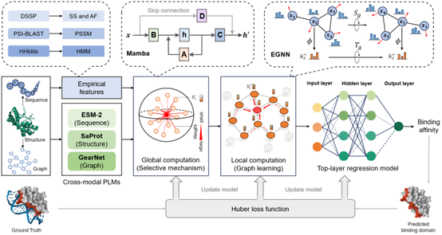

# INAB: Identify Nucleic Acid Binding Domain via Cross-modal Protein Language Models and Multiscale Computation

## Dependencies
> Python Version: 3.10.16
```
troch==2.5.1
biopython==1.84
mamba-ssm==2.2.4
pandas==1.5.3
scikit-learn==1.6.0
tqdm==4.67.1
transformers==4.28.1
tyro==0.9.6
torchdrug==0.2.1
fair-esm==2.0.0
causal-conv1d==1.5.0.post8
numpy==1.24.4
```

## Third-party Tools

[PSI-BLAST](https://ftp.ncbi.nlm.nih.gov/blast/executables/blast+/LATEST/)
[HH-suite](https://github.com/soedinglab/hh-suite)
[DSSP](https://swift.cmbi.umcn.nl/gv/dssp/DSSP_5.html)
[ESM-2](https://github.com/facebookresearch/esmn)
[GearNet](https://github.com/DeepGraphLearning/GearNet)
[SaProt](https://github.com/westlake-repl/SaProt)
[Foldseek](https://github.com/steineggerlab/foldseek)

## Dataset and pretrained models

Downlaod here [Google Drive](https://drive.google.com/drive/folders/1KLv127DwIMTm308UcSMp-UsKhIjPhhyH?usp=sharing).

## Usage
**1. Extract features**
```
cd scripts
python extract_feats.py
```
**2. Compine features**
```
cd scripts
python combine_feats.py
```
**3. Predict using pretrained model**
```
python predict.py --model_path <path of pretrained model> --input_features <path of combined features>
```
