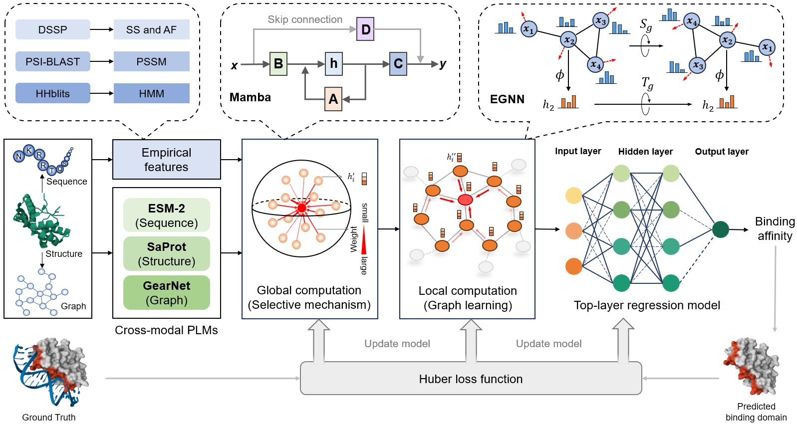

# INAB: Identify Nucleic Acid Binding Domains via Cross-modal Protein Language Models and Multiscale Computation



## Dependencies

- **Python Version:** 3.10.16  
- **System:** Ubuntu 22.04.4

```bash
pip install torch==2.4.1
pip install -r requirements.txt
```

## Third-party Tools

- [PSI-BLAST](https://ftp.ncbi.nlm.nih.gov/blast/executables/blast+/LATEST/)
- [HH-suite](https://github.com/soedinglab/hh-suite)
- [DSSP](https://swift.cmbi.umcn.nl/gv/dssp/DSSP_5.html)
- [ESM-2](https://github.com/facebookresearch/esmn)
- [GearNet](https://github.com/DeepGraphLearning/GearNet)
- [SaProt](https://github.com/westlake-repl/SaProt)
- [Foldseek](https://github.com/steineggerlab/foldseek)

## Dataset and Pretrained Models

- Download the dataset and pretrained models from [Google Drive](https://drive.google.com/drive/folders/1KLv127DwIMTm308UcSMp-UsKhIjPhhyH?usp=sharing).
- After downloading, extract the dataset to the `dataset` directory and place the model weights in the `model_parameters` directory.
- The dataset contains features and hierarchical labels. Provided features include only PDB files and PSSM/HHM profiles; additional features will be automatically extracted when running `predict.py`.
- Pretrained models with the suffix "GraphBind" were trained on the GraphBind training set; all other models were trained on the INAB training set.

## Usage

### 1. Prediction with Pretrained Models

You can choose either the DNA or RNA model by specifying the `--model_path` argument.

```bash
python predict.py --model_path ./model_parameters/INAB_DNA.pth --pdb_path ./demo/features/5f7q_E.pdb
```

Prediction results will be saved in the same directory as the input PDB file, with the filename formatted as <pdb_id>_output.txt (e.g., 5f7q_output.txt).

---

### 2. Training

#### Step 1: Prepare Features for Training

```bash
python -m feature.extract --pdb_dir ./dataset/INAB/features
```

To specify a GPU device, use:

```bash
CUDA_VISIBLE_DEVICES=INDEX python -m feature.extract --pdb_dir ./dataset/INAB/features
```

#### Step 2: Run Training

```bash
python train.py --dataset INAB --task dna
```

Or for RNA task:

```bash
python train.py --dataset INAB --task rna
```